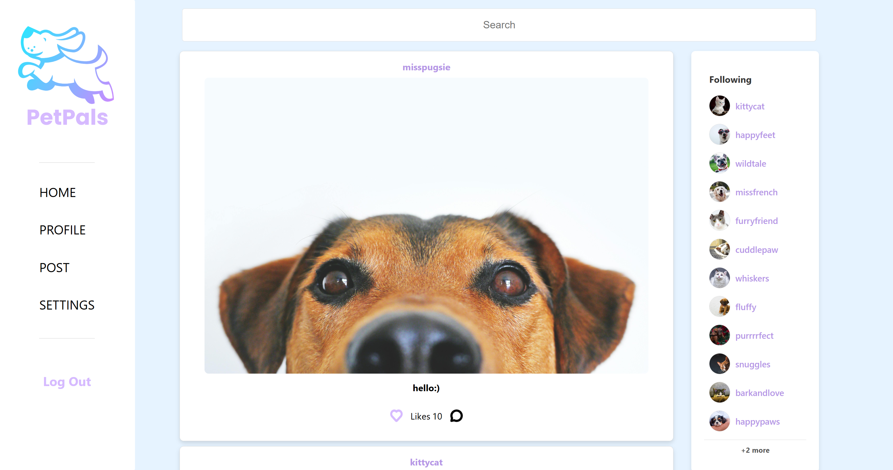

<!-- PROJECT SHIELDS -->
[![Contributors][contributors-shield]][contributors-url]
[![Forks][forks-shield]][forks-url]
[![Stars][stars-shield]](https://github.com/gitober/PetPals/stargazers)
[![Issues][issues-shield]][issues-url]

<!-- PROJECT HOME PAGE -->
<div align="left">
  <a href="https://github.com/gitober/PetPals">
    
  </a>
  <h3>PetPals - Social Platform for Pet Owners</h3>
  <p align="left">
    A full-stack web application connecting pet owners to share moments, interact, and build a vibrant pet-loving community.
    <br /><br />
  </p>
</div>

---

<!-- TABLE OF CONTENTS -->
<details>
  <summary>Table of Contents</summary>
  <ol><a id="top"></a>
    <li><a href="#about-the-project">About The Project</a></li>
    <li><a href="#documentation">Documentation</a></li>
    <li><a href="#technologies-used">Technologies Used</a></li>
    <li><a href="#getting-started">Getting Started</a></li>
    <li><a href="#usage">Usage</a></li>
    <li><a href="#contributions-and-acknowledgments">Contributions and Acknowledgments</a></li>
    <li><a href="#further-development-plan">Further Development Plan</a></li>
    <li><a href="#license">License</a></li>
    
  </ol>
</details>

---

## About The Project

**PetPals** is a full-stack web application that started as a school project and has since evolved into a personal initiative to create a vibrant social platform for pet owners. With features like profile management, post sharing, commenting, and following systems, PetPals aims to foster a community where pet enthusiasts can connect and share their pet stories.

This project represents a journey of learning, creativity, and passion for both web development and pet communities. The contributors have put great effort into making PetPals a feature-rich, user-friendly application.

<p align="right">(<a href="#top">back to top</a>)</p>

--- 

## Documentation

For detailed documentation, visit:
- **[Project Overview](docs/project-overview.md)**

- **[System Design](docs/architecture/system-design.md)**
- **[Project Settings](docs/development/project-settings/settings-overview.md)**
- **[Application Walkthrough](docs/user-documentation/application-features.md)**

<p align="right">(<a href="#top">back to top</a>)</p>

---

<!-- TECHNOLOGIES USED -->
## Technologies Used

PetPals was built with the following technologies:

-  **React**: Frontend library for building user interfaces.
-  **Node.js**: Backend runtime environment.
-  **Express.js**: Backend web framework.
-  **MongoDB**: NoSQL database.
-  **JWT**: Secure token-based authentication.
-  **Multer**: File upload middleware for images.

<p align="right">(<a href="#top">back to top</a>)</p>

---

<!-- GETTING STARTED -->
## Getting Started

To get started with PetPals, follow the detailed setup guide in the [Settings Overview](docs/settings-overview.md), which covers environment configuration, dependencies, and more.

### Quick Setup

1. Clone the repository:
   ```bash
   git clone https://github.com/gitober/PetPals.git
   ```
2. Navigate to the project directory:
   ```bash
   cd PetPalsApp
   ```
3. Install dependencies:
   ```bash
   npm install
   ```

<p align="right">(<a href="#top">back to top</a>)</p>

---

<!-- USAGE -->
## Usage

PetPals allows users to:
- Create and manage profiles.
- Share posts with images and captions.
- Interact with others through likes and comments.
- Follow other pet owners to stay updated on their posts.

For a complete guide, refer to the [Application Walkthrough](docs/user-documentation/application-walkthrough.md).

<p align="right">(<a href="#top">back to top</a>)</p>

---

### Contributions and Acknowledgments
This project was envisioned and built by its creators, whose hard work and dedication laid the foundation for its success. Their efforts continue to inspire ongoing improvements and innovation.

We value the hard work of everyone contributing to this project. Below are the creators and top contributors who have helped shape it:

<a href="https://github.com/gitober/PetPals/graphs/contributors">
  
</a>

<p align="right">(<a href="#top">back to top</a>)</p>

---

<!-- FURTHER DEVELOPMENT PLAN -->
## Further Development Plan

- Integration with cloud storage services for image uploads.
- Implementation of push notifications for user interactions.
- Adding a marketplace for pet-related products.
- Advanced analytics for user activity and post engagement.

<p align="right">(<a href="#top">back to top</a>)</p>

---

<!-- LICENSE -->
## License

Distributed under the MIT License. See [LICENSE.txt](LICENSE.txt) for details.

<p align="right">(<a href="#top">back to top</a>)</p>

---


<!-- MARKDOWN LINKS & IMAGES -->
[contributors-shield]: https://img.shields.io/github/contributors/gitober/PetPals.svg?style=for-the-badge
[contributors-url]: https://github.com/gitober/PetPals/graphs/contributors
[forks-shield]: https://img.shields.io/github/forks/gitober/PetPals.svg?style=for-the-badge
[forks-url]: https://github.com/gitober/PetPals/network/members
[stars-shield]: https://img.shields.io/github/stars/gitober/PetPals.svg?style=for-the-badge
[stars-url]: https://github.com/gitober/PetPals/stargazers
[issues-shield]: https://img.shields.io/github/issues/gitober/PetPals.svg?style=for-the-badge
[issues-url]: https://github.com/gitober/PetPals/issues
