# Application Walkthrough

The application offers various features that allow users to navigate, interact, and manage their profiles, posts, and connections. Below is a detailed walkthrough of its key functionalities.

*Note: Images used for application testing were sourced from [Pixabay](https://pixabay.com/), a platform for free, high-quality stock images.*

## Contents
- [Login, Forgot Password, and Registration](#login-forgot-password-and-registration)
- [Navigation and Search](#navigation-and-search)
- [Home Feed](#home-feed)
- [Profile Page](#profile-page)
- [User Profile Page](#user-profile-page)
- [Post Creation and Management](#post-creation-and-management)
- [Follow Modal](#follow-modal)
- [Settings](#settings)

---

### Login, Forgot Password, and Registration
- **Login:** Users log in with their credentials to access the dashboard.
  
  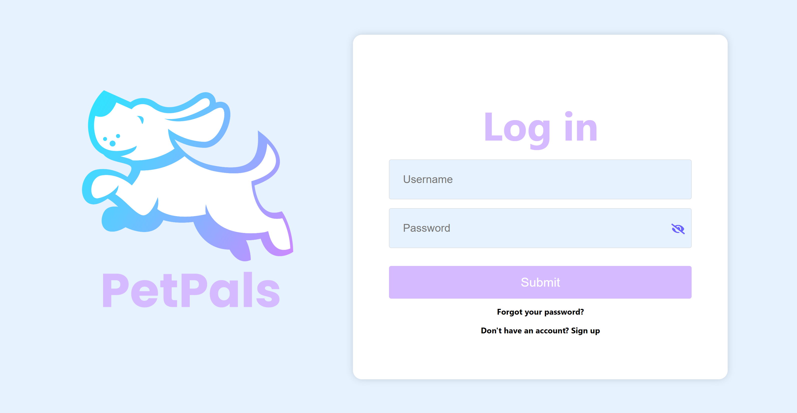

- **Register:** New users can sign up by completing a form and clicking "Sign up."

  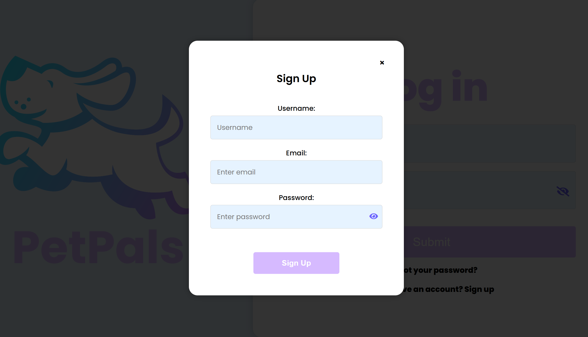

- **Forgot Password:** Clicking "Forgot your password?" sends a temporary password via email, which can be used to log in and update the password in settings.

  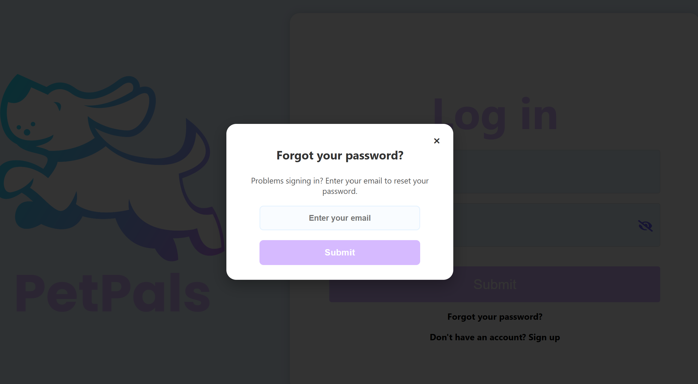

(<a href="#contents">back to top</a>)

---

### Navigation and Search
- **Search Bar:** Search for other users dynamically with real-time results and error handling for invalid queries.

  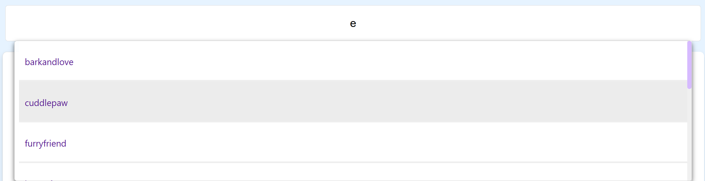

- **Sidebar:** Access essential features like creating a post, navigating to the home feed, viewing your profile, accessing settings, and logging out.

  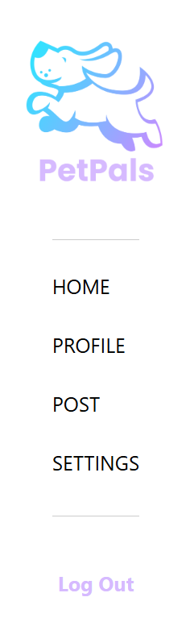

(<a href="#contents">back to top</a>)

---

### Home Feed
- **Feed Display:** Displays posts from all users, including profile pictures, usernames, images, content, and interaction buttons (like and comment). Also features your followings list, allowing you to view the users you are following and navigate directly to their profiles by clicking on their names.

  

- **Like Functionality:** Like or unlike posts in real-time, with updates to the like count.

- **Comment Popup:** View and submit comments. Post owners can delete comments or posts directly.

  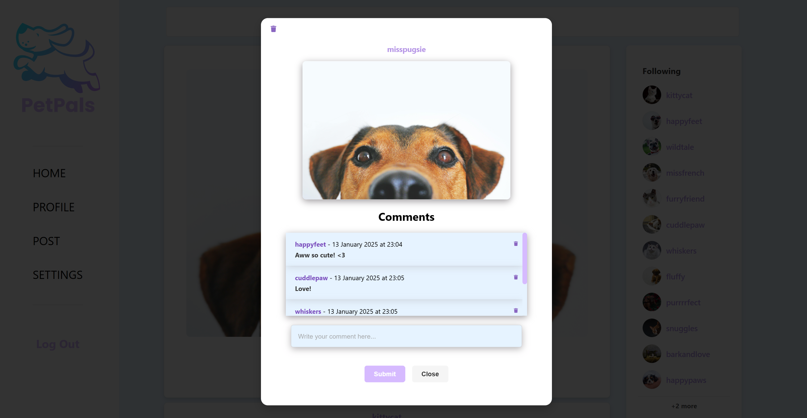

(<a href="#contents">back to top</a>)

---

### Profile Page
- **Profile Overview:** Displays username, profile picture, bio, followers, and following counts. Users can view their posts.

- **Post Management:** Delete your posts or comments on your posts dynamically.

- **Followers and Following Modal:** View and navigate to other user profiles.

  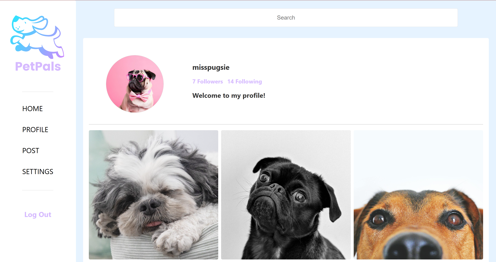

(<a href="#contents">back to top</a>)

---

### Post Creation and Management
- **Post Creation:** Create posts with text and images. Preview images before submission.

  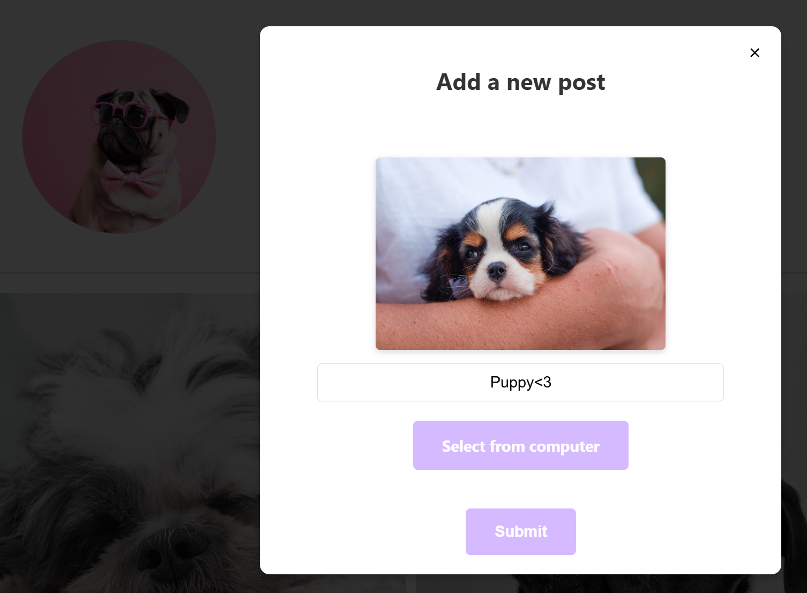

- **Post Deletion:** Delete posts dynamically from the feed or profile page.

  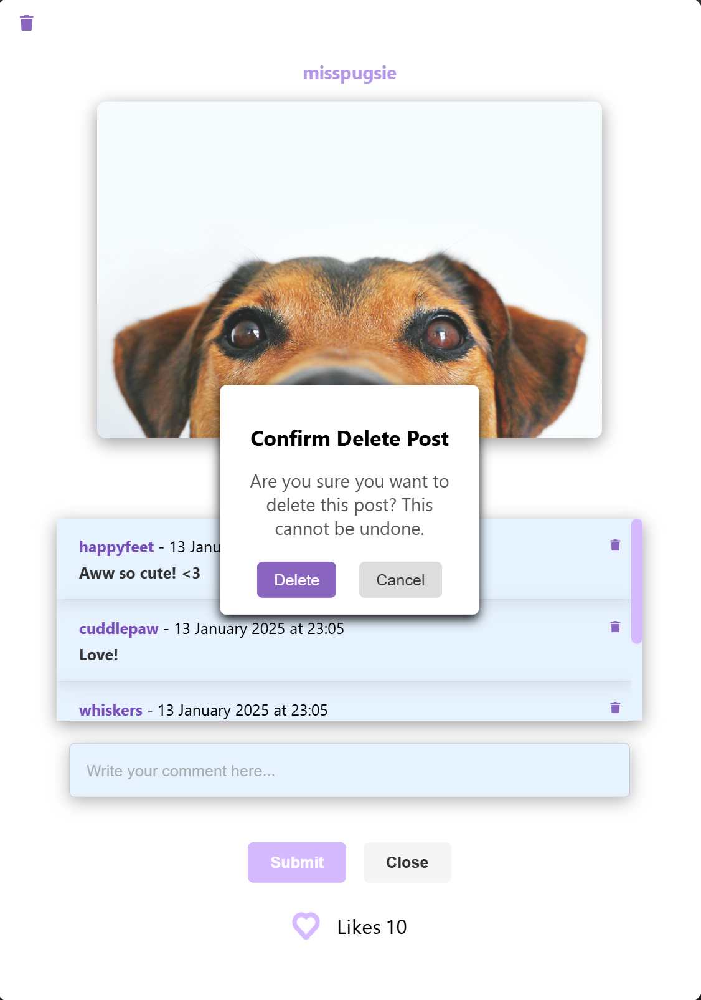

- **Comment Deletion:** Post owners can delete comments directly from the feed or profile page.

  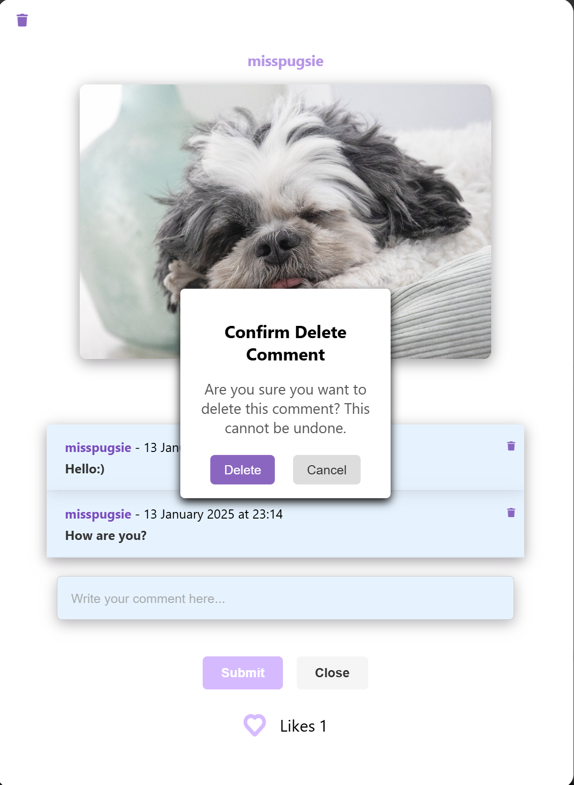

(<a href="#contents">back to top</a>)

---

### User Profile Page
- **Profile Overview:** View another user’s username, bio, followers, and following counts.

- **Post Interaction:** Like and comment on their posts.

- **Followers and Following Modal:** Displays follower and following lists.

  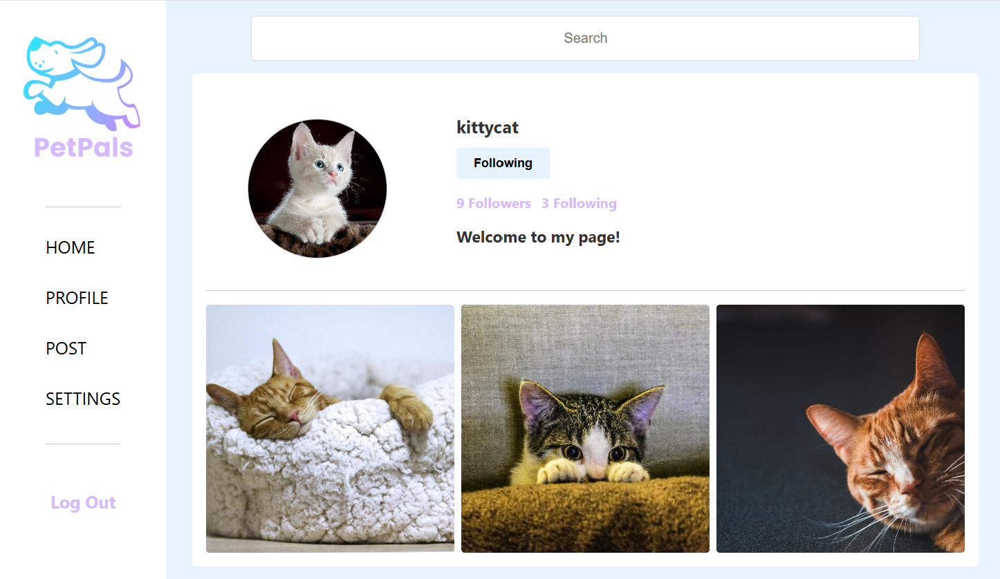

- **Follow/Unfollow:** Follow or unfollow users dynamically.

  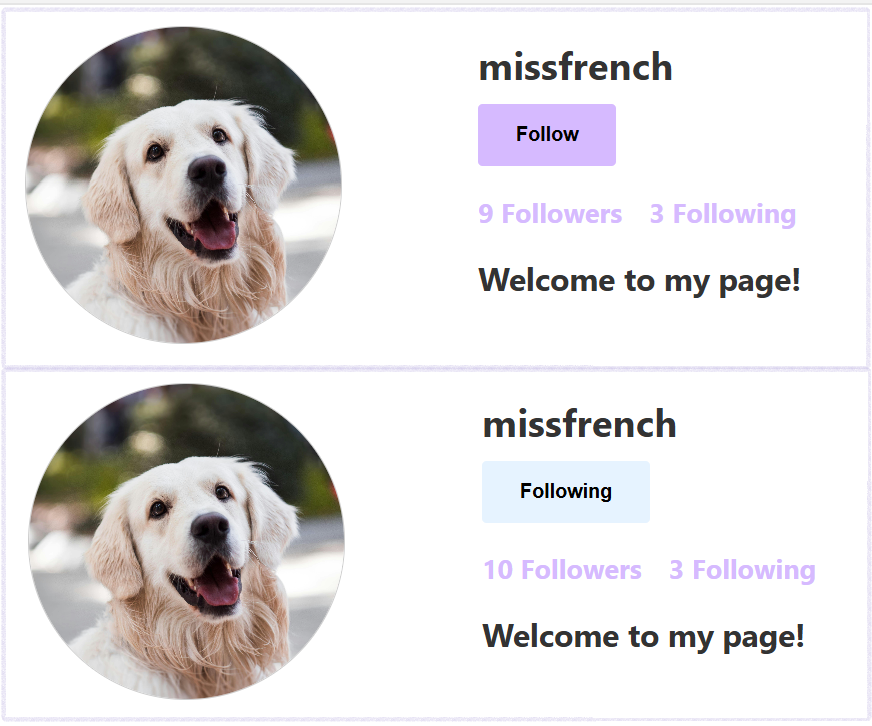

(<a href="#contents">back to top</a>)

---

### Follow Modal
- **Follow System:**
  - **Follow Modal:** Displays followers and following lists with profile pictures and usernames.
  - **Dynamic Updates:** Actions update follower and following counts in real-time.

  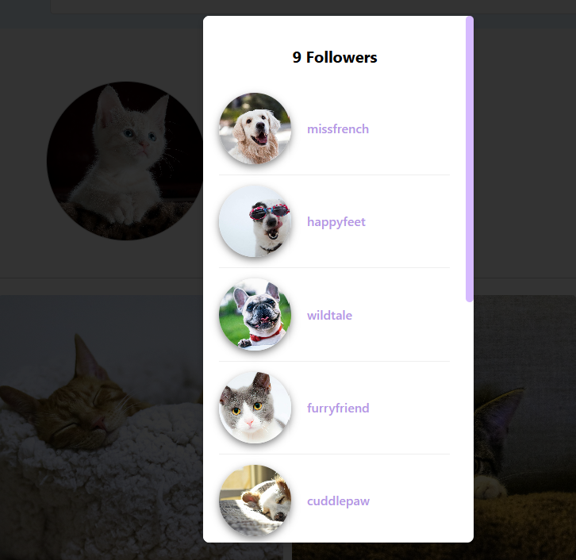

(<a href="#contents">back to top</a>)

---

### Settings
- **Settings Page:** Update your profile picture, username, bio, or password securely. Changes are validated and applied dynamically.

  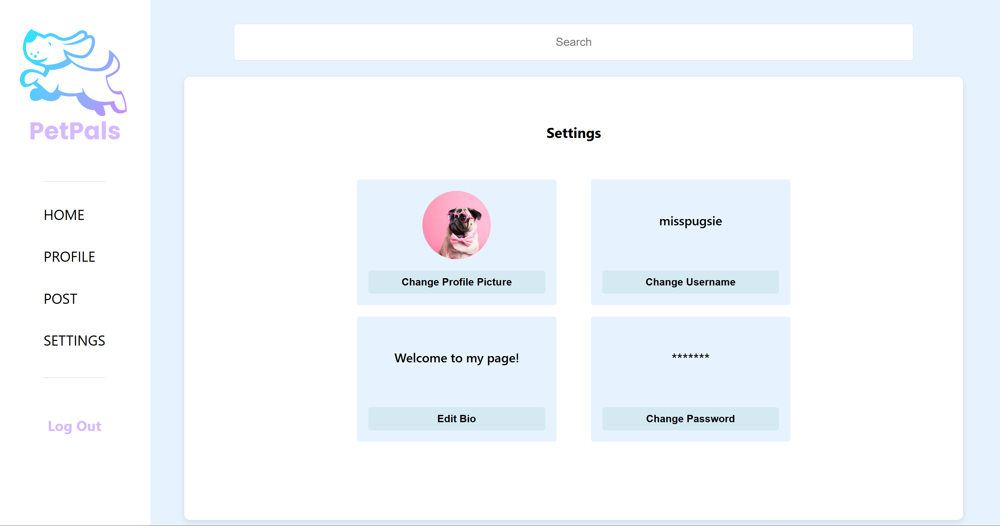

  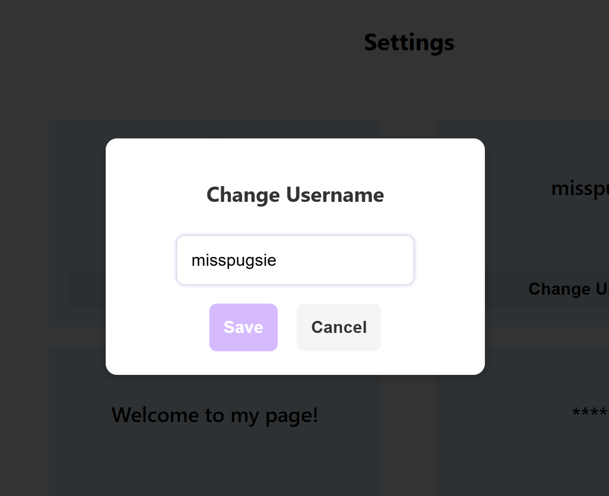

  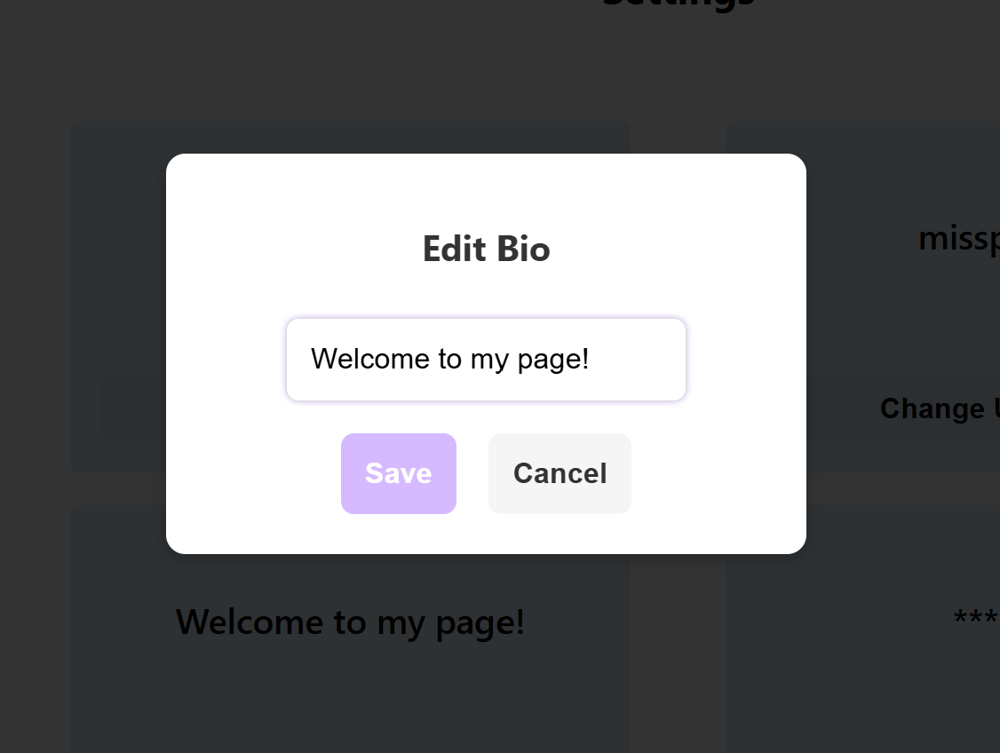

  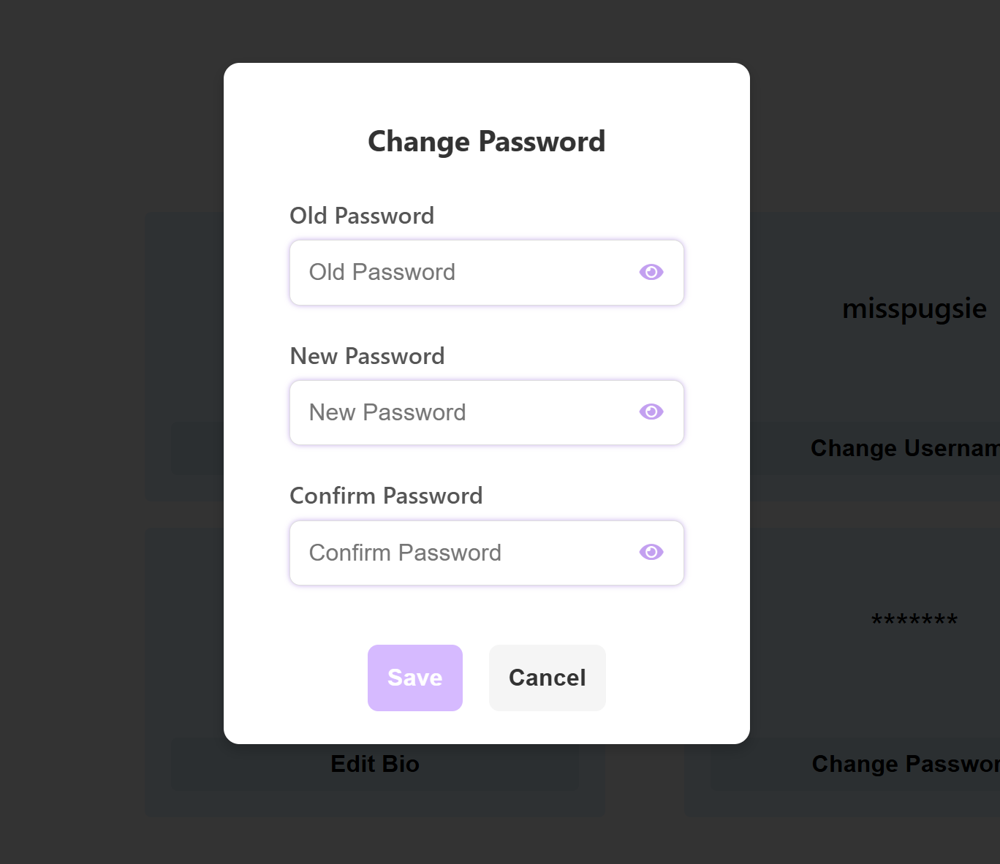

(<a href="#contents">back to top</a>)

---

## Summary
The application provides a user-friendly interface for managing profiles, posts, and connections. Key features include:
- Secure login, registration, and password recovery, with clear error messages for invalid inputs or failed attempts.
- Intuitive navigation with a sidebar and search functionality, including error feedback for invalid or empty search queries.
- Real-time updates for likes, comments, posts, and follow actions.
- Dynamic and responsive design for seamless use across devices.
- Comprehensive settings to manage profile information and security.

This walkthrough highlights the robust functionality designed to enhance user engagement and satisfaction.

---

[Back to Project Overview](../project-overview.md)